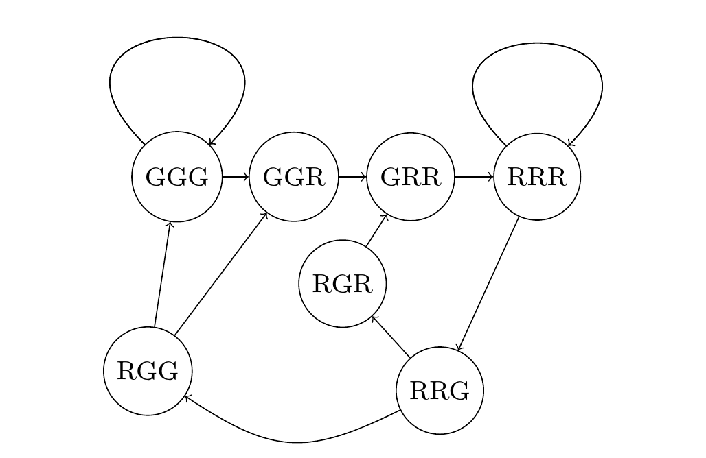

>A row measuring seven units in length has red blocks with a minimum length of three units placed on it,
>such that any two red blocks (which are allowed to be different lengths) are separated by at least one grey square. 
>There are exactly seventeen ways of doing this.
>How many ways can a row measuring fifty units in length be filled?

Consider a sliding window of 3 consecutive blocks starting at the beginning of the row. We can make a directed graph whose vertices are labeled by the color of the blocks in the window (in order), with a directed edge A -> B if sliding the window one block to the right changes the colors from A to B. For a valid tiling, the graph looks like this:

R denotes a red square and G a grey square. A valid tiling of length n corresponds to a path of length n-3 starting on one of GGG, GGR, GRR, or RRR and ending on one of GGG,RGG,RRG, or RRR. We can find the number of these paths by finding <b>A</b><sup>n-3</sup> where <b>A</b> is the adjacency matrix of the graph. The time complexity is O(n<sup>3</sup> log(n)), or slightly better if we use numpy.

  ```
  $ time ./p114.py 
  16475640049
  real	0m0.110s
  user	0m0.086s
  sys	0m0.017s
  ```

